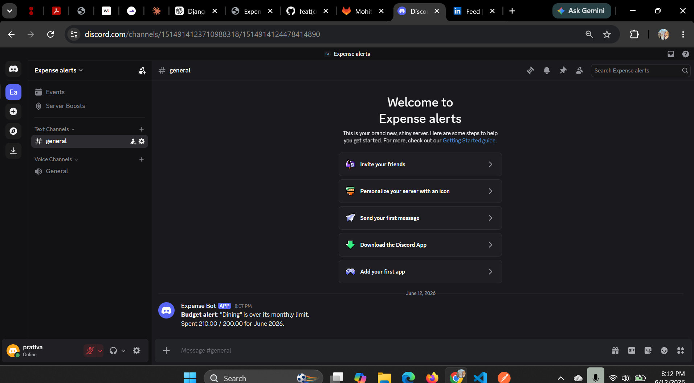

# Expense Tracker API — Intern Screening

A Django REST Framework backend for tracking personal expenses with categories, currency conversion, and Discord budget alerts.

## Setup

```bash
python -m venv .venv
.venv\Scripts\activate          # Windows
# source .venv/bin/activate     # Mac/Linux

pip install django djangorestframework python-dotenv requests

cp .env.example .env             # fill in SECRET_KEY and DISCORD_WEBHOOK_URL

python manage.py migrate
python manage.py runserver
```

## Quick start (authentication)

POST /api/auth/register/ {"username": "prativa", "password": "test1234", "email": "p@test.com"}

→ {"token": "abc123...", "user_id": 1, "username": "prativa"}
POST /api/auth/login/ {"username": "prativa", "password": "test1234"}

→ {"token": "abc123..."}

All other requests need this header:
Authorization: Token abc123...

## Endpoints

| Method             | Endpoint                       | Description                            |
| ------------------ | ------------------------------ | -------------------------------------- |
| POST               | /api/auth/register/            | Register a new user                    |
| POST               | /api/auth/login/               | Login, get token                       |
| GET / POST         | /api/categories/               | List / create categories               |
| GET / POST         | /api/expenses/                 | List (with filters) / create expenses  |
| GET / PUT / DELETE | /api/expenses/{id}/            | Retrieve / update / delete an expense  |
| GET                | /api/expenses/summary/         | Per-category totals in BASE_CURRENCY   |
| GET                | /api/expenses/monthly-summary/ | Month-by-month totals for a given year |

Query params for `GET /api/expenses/`: `start_date`, `end_date` (YYYY-MM-DD, inclusive), `search` (title keyword, case-insensitive).

---

## My Features

### Authentication

**Overview:** Token-based authentication using `rest_framework.authtoken`. Every endpoint except register/login requires `Authorization: Token <token>`.

**Design decisions:**

- Each Category and Expense has a `user` ForeignKey — all queries are filtered by `request.user`, so users only ever see their own data.
- `unique_together = ("user", "name")` on Category — two different users can each have a "Food" category without conflict.
- Token auth chosen over JWT for simplicity — built into DRF, no extra dependencies.

**API changes:** Added `/api/auth/register/` and `/api/auth/login/`. All other endpoints now require authentication.

**Example:**
POST /api/auth/register/

{"username": "prativa", "password": "test1234", "email": "p@test.com"}
201 Created

{"token": "971c92cfe247633dfd5d4373c5b0ab9c8e02cc67", "user_id": 2, "username": "prativa"}

**Assumptions:** Token never expires (no refresh mechanism) — acceptable for this scope.

---

### Feature 1 — Currency Conversion

**Overview:** Each expense stores its own `currency` (3-letter ISO code, default "USD"). The summary endpoint converts every expense to `BASE_CURRENCY` (set in `.env`) using live exchange rates.

**Design decisions:**

- Rates fetched from `open.er-api.com` (free, no API key required).
- Conversion happens per-expense, not per-category-aggregate, so categories with mixed currencies are handled correctly.
- If the rate API fails for any reason, conversion falls back to `rate=1.0` instead of crashing — degrades safely.
- `validate_currency` in the serializer normalizes input to uppercase (e.g. "eur" → "EUR").

**Model change:** `currency = models.CharField(max_length=3, default="USD")` added to Expense.

**Example:**
POST /api/expenses/

{"title": "Hotel in Paris", "amount": "120.00", "currency": "EUR", "category": 1, "date": "2026-06-09"}
201 Created

{"id": 7, "title": "Hotel in Paris", "amount": "120.00", "currency": "EUR", "category": 1, "category_name": "Travel", "date": "2026-06-09", "notes": ""}
GET /api/expenses/summary/ (BASE_CURRENCY=USD)

{

"base_currency": "USD",

"categories": [

{"category": "Travel", "total": 138.61, "as_of": "2026-06-12"}

]

}

**Known limits:** Today's exchange rate is used for all conversions regardless of the expense's date — historical rates are not supported.

---

### Feature 2 — Budget Threshold Bot Alerts

**Overview:** Each category can have an optional `monthly_limit`. When a created or updated expense pushes that category's month-to-date total over its limit, a Discord message is sent automatically.

**Design decisions:**

- Used a Discord webhook instead of Telegram (Telegram required SMS verification not available for this account; README permits Discord/Slack as alternatives).
- Alert fires **exactly once** per threshold crossing: `previous_total < limit AND new_total > limit`. This avoids spamming on every subsequent expense once the category is already over budget.
- If `DISCORD_WEBHOOK_URL` is not set in `.env`, alerts silently skip — the API still works normally without a configured bot.

**Model change:** `monthly_limit = models.DecimalField(null=True, blank=True)` added to Category.

**Example:**
PATCH /api/categories/2/

{"monthly_limit": "200.00"}
POST /api/expenses/ ← this pushes "Dining" total from 150 to 210, over its 200 limit

{"title": "Dinner 2", "amount": "60.00", "currency": "USD", "category": 2, "date": "2026-06-12"}
201 Created — and Discord alert delivered:

"Budget alert: "Dining" is over its monthly limit. Spent 210.00 / 200.00 for June 2026."

**Screenshot of delivered alert:**



**Assumptions:** Comparison uses raw stored amounts (not currency-converted) — if a category has expenses in multiple currencies, totals are summed as-is. Converting to BASE_CURRENCY before comparison would be a future improvement.

---

### Optional Feature 1 — Expense Search/Filtering

**Overview:** `GET /api/expenses/?search=<keyword>` filters expenses by title, case-insensitive.

**API change:** Added `search` query param to `GET /api/expenses/`. Works alongside existing `start_date`/`end_date` filters.

**Example:**
GET /api/expenses/?search=dinner
200 OK

[

{"id": 2, "title": "Dinner 1", "amount": "150.00", ...},

{"id": 3, "title": "Dinner 2", "amount": "60.00", ...}

]

---

### Optional Feature 2 — Monthly Spending Summary

**Overview:** `GET /api/expenses/monthly-summary/?year=2026` returns spending totals for all 12 months of a given year, converted to BASE_CURRENCY.

**Design decisions:**

- Defaults to the current year if `?year=` is omitted.
- Returns all 12 months including ones with `total: 0.0`, so a frontend can render a full year chart without special-casing missing months.
- Route placed before `<int:pk>/` in urls.py — same fix as Bug 5, to avoid "monthly-summary" being matched as a pk.

**Example:**
GET /api/expenses/monthly-summary/?year=2026
200 OK

{

"year": 2026,

"base_currency": "USD",

"months": [

{"month": "January", "month_number": 1, "total": 0.0},

...

{"month": "June", "month_number": 6, "total": 348.83},

...

]

}

---

## Bugs Found and Fixed

### Bug 1 — Typo in ExpenseSerializer field list

**File:** `expenses/serializers.py`
**Description:** `fields` list contained `"catgory"` instead of `"category"`, causing DRF to raise `Field name catgory is not valid`.
**Root cause:** Typo.
**Fix:** Changed `"catgory"` → `"category"`.

### Bug 2 — Date filter was exclusive instead of inclusive on start_date

**File:** `expenses/views.py`
**Description:** `date__gt=start_date` excluded expenses dated exactly on `start_date`.
**Root cause:** Wrong ORM lookup suffix.
**Fix:** Changed `date__gt` → `date__gte`.

### Bug 3 — NameError: `serialzer` undefined on POST /api/expenses/

**File:** `expenses/views.py`
**Description:** Success response referenced `serialzer.data` (missing the "i"), causing a 500 error on every expense creation.
**Root cause:** Typo in variable name.
**Fix:** Changed `serialzer.data` → `serializer.data`.

### Bug 4 — `Sum` not imported in views.py

**File:** `expenses/views.py`
**Description:** `expense_summary` used `Sum("amount")` but `Sum` was never imported, raising `NameError` on `GET /api/expenses/summary/`.
**Root cause:** Missing import.
**Fix:** Added `from django.db.models import Sum`.

### Bug 5 — URL ordering: `expenses/summary/` matched as a `<pk>` value

**File:** `expenses/urls.py`
**Description:** `expenses/<pk>/` was defined before `expenses/summary/`. Django matched "summary" as a pk value, causing `Expense.objects.get(pk="summary")` to fail.
**Root cause:** Static routes must be defined before dynamic `<pk>` routes.
**Fix:** Moved `expenses/summary/` above `expenses/<int:pk>/`, and changed `<pk>` to `<int:pk>` for extra protection.

---

## Tech Stack

Python 3 · Django 5 · Django REST Framework · SQLite · python-dotenv · requests
